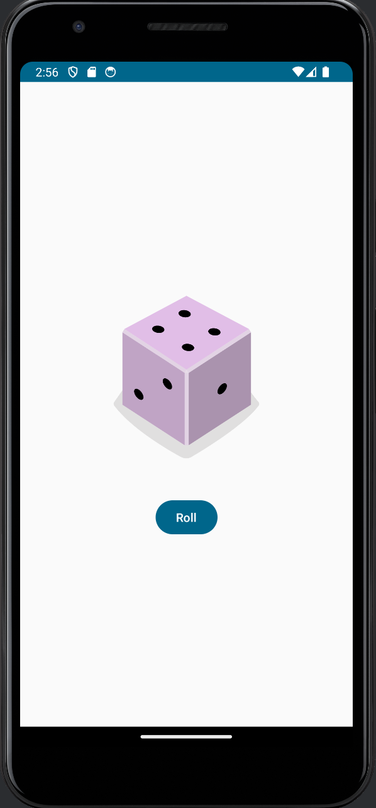

# Dice roller app

Following this tutorial: https://developer.android.com/codelabs/basic-android-kotlin-compose-build-a-dice-roller-app.

This is me trying to keep up with Android development after a long time of not programming on Android.

## Result

